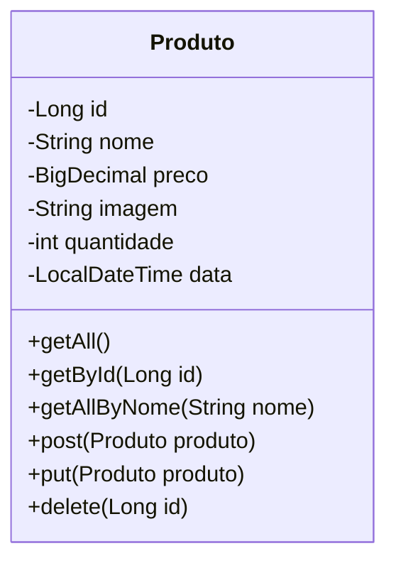

# FastGen - Delivery de Alimentos Backend

<br />

<div align="center">
    
</div>


<br />

## 📌 Descrição

*O projeto FastGen é uma plataforma de delivery, onde facilitará para o estabelecimento o cadastro e gerenciamento do seu estoque de forma confiável.*

------

## 🚀 Sobre esta API

A API FastGen permite que o estabelecimento realize o cadastro e gerenciamento de seus produtos. Com endpoints seguros e intuitivos, a API facilita e trás segurança para nosso cliente.

### 2.1. Principais Funcionalidades

1. Listar todos os produtos
1. Buscar Produto por ID
1. Buscar Produto por nome
1. Cadastrar Produto
1. Atualizar Produto
1. Deletar Produto

------

## 🧩 Diagrama de Classes



------

## 🗃️ Diagrama Entidade-Relacionamento (DER)

<div align="center">
    
</div>


------

## 🛠️ Tecnologias utilizadas

| Item                          | Descrição           |
| ----------------------------- | ------------------- |
| **Servidor**                  | Servidor WEB / HTTP |
| **Linguagem de programação**  | Java                |
| **Framework**                 | Spring              |
| **ORM**                       | Hibernate           |
| **Banco de dados Relacional** | MySQL               |

------

## 🧪 Configuração e Execução

1. Clone o repositório do Projeto [Projeto_01_Backend](https://github.com/Cavaleiros-Templarios/Projeto_01_Backend) dentro da pasta do *Workspace* do Eclipse/STS

```bash
git clone https://github.com/Cavaleiros-Templarios/Projeto_01_Backend
```a

2. **Abra o Eclipse/STS** e selecione a pasta do *Workspace* onde você clonou o repositório do projeto
3. No menu superior do Eclipse/STS, clique na opção: **File 🡲 Import...**
4. Na janela **Import**, selecione a opção: **General 🡲 Existing Projects into Workspace** e clique no botão **Next**
5. Na janela **Import Projects**, no item **Select root directory**, clique no botão **Browse...** e selecione a pasta do Workspace onde você clonou o repositório do projeto
6. O Eclipse/STS reconhecerá automaticamente o projeto
7. Marque o Projeto_01_Backend no item **Projects** e clique no botão **Finish** para concluir a importação


```
## 📬 Contato

Desenvolvido por:

- [**Alex Ikezili**](https://github.com/alexikezili)  
- [**Gustavo Brassaroto Lira**](https://github.com/Brassaroto)  
- [**Cristiano Forner**](https://github.com/cristianoforner)  
- [**Fabricio Vicente Soares**](https://github.com/Fabriciovics)  
- [**Marcos Meneses**](https://github.com/MarcosvMeneses)  
- [**Pedro Henrique**](https://github.com/phccoelho)  
- [**Thiago Tasseli**](https://github.com/tasselii)  
- [**Wesley Lima**](https://github.com/Wezzlim)  

Fique à vontade para tirar dúvidas, dar sugestões ou contribuir! 😄
